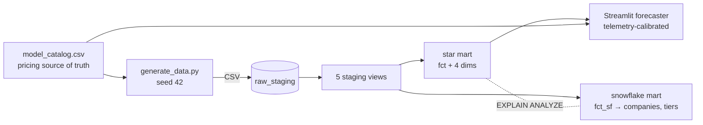

# Andvari

**LLM API telemetry, end to end.** Synthetic Claude-style API traffic generated with
domain-appropriate statistical distributions, loaded into Postgres, modelled two ways
with dbt (star *and* snowflake, over the same source, so the trade-off can be
measured rather than argued), and surfaced through an interactive cost forecaster.

Extracted from the `command_center` monorepo on 2026-07-19 and now self-contained.

> Read `PROJECT_NOTES.md` before changing anything — it lists what was inherited
> broken and which published claims the code does not currently support.

## Run it

```bash
cp .env.example .env                        # set DB_PASSWORD and READER_DB_PASSWORD
docker compose up -d db                     # Postgres 16, bound to 127.0.0.1:55432
docker compose --profile seed run --rm seed # generate 500K rows and load them
docker compose --profile seed run --rm dbt  # build 14 models, run 145 data tests
docker compose up -d app                    # http://localhost:8501

python -m pytest app/tests data/tests -q    # 158 Python tests, no database needed
```

## What's inside

| Path | What |
|---|---|
| `app/` | Streamlit cost forecaster (Python 3.12). Calibrates its defaults from the star schema via the read-only role; falls back to parametric mode when the database is absent |
| `dbt/` | 14 models: 5 staging views, 5 star, 4 snowflake. 143 declarative tests |
| `data/` | Generator (fixed seed 42) and loader (Python 3.12) |
| `docs/` | `CASE_STUDY.md` plus the original site pages, kept verbatim |
| `project.yaml` | How this appears on lukeudell.com|

## Lineage



## The dataset

500K API requests · 5,000 users · 5 models · 5 endpoints · 91 days · seed 42.

Not random noise. Latency is log-normal (μ=6.5, σ=0.8) because real API latency
clusters around a median with a heavy right tail from cold starts and long context
windows. Token counts follow a Pareto (α=1.5) because a small fraction of enterprise
users send enormous prompts. Traffic follows a sinusoidal diurnal curve via rejection
sampling, −85% overnight and −40% at weekends. Status codes are weighted categorical
(94/3/2/1). Safety flags are a Bernoulli trial at p=0.008.

The reason for the care: realistic distributions expose real query-planner behaviour
and index selectivity. Uniform random data makes every plan look the same.

## The comparison worth reading

Both marts are built over the same source so the same question can be asked
twice — and remeasured on any machine, because the number is a command, not a
claim:

```bash
python data/benchmark_star_vs_snowflake.py
```

| Query | Schema | Joins | Median (ms)¹ |
|---|---|---|---|
| Cost by model | star | 1 | 51 |
| Cost by industry | star | 1 | **53** |
| Cost by industry | snowflake | 3 | 56 |

¹ Median of 5 warm runs, Postgres 16 in Docker on a dev workstation.

The same queries measured in the source monorepo showed 51 ms vs 206 ms — a 4×
gap — because that planner ran the snowflake's three hash joins without
parallelism. On a host where every plan parallelises, the gap narrows to a few
percent at 500K rows. Both results are the same lesson, and the reason both
schemas exist: the denormalisation trade-off is real but environment-dependent.
Storage redundancy buys join elimination; what that's worth is a measurement,
not a slogan. The snowflake earns its cost when dimensions are large,
frequently updated, or when write-path consistency matters more than read
performance — which, here, it does not.

## CI

`.github/workflows/ci.yml`, three jobs, ordered by how fast they fail:

| Job | What |
|---|---|
| App tests | theme/XSS, forecast arithmetic, catalog, and DB-baseline suites, on Python 3.12 |
| Pipeline | generate, load and `dbt build` against a real Postgres service container |
| Security | `pip-audit` (blocking) and a Trivy image scan |

The pipeline job is the one worth having: it proves the generator, loader and
models still agree, against the same engine production uses. It runs `dbt build`
rather than `dbt run` on purpose -- `run` skips the tests, which is how a sibling
project shipped two that had never passed.

`pip-audit` blocks. Accepted findings are explicit `--ignore-vuln` flags with a
reason in `SECURITY.md`, not a `|| true`. Dependabot proposes weekly upgrades,
grouped per ecosystem.

## Standards

Built to `udell-blueprints` — the engineering standards mirrored at lukeudell.com/standards. PROJECT_NOTES.md records the ones that bite
in this project.
